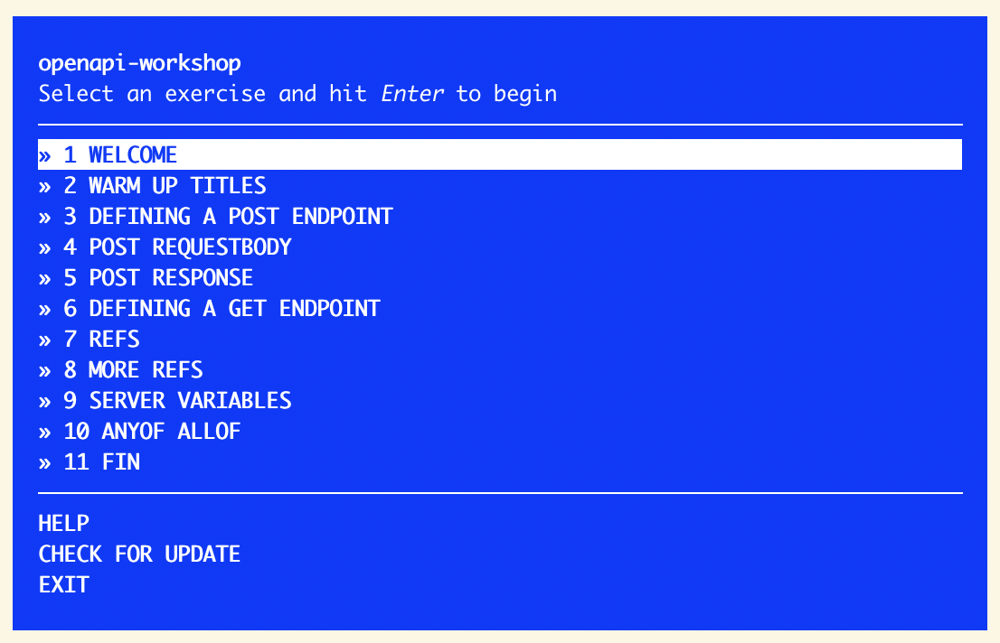

# OpenAPI Workshop

[![NPM version][npm-image]][npm-url]
[![node][node-image]][node-url]

> Learn how to use the OpenAPI Specification

It's kinda strange, but many people still don't know Markdown, although there is nothing hard about this amazing tool. This workshopper will teach you how to use Markdown.

> **OAS** is a specification for machine-readable interface files for describing, producing, consuming, and visualizing RESTful web services
>
> — about [OpenAPI] at **Wikipedia**

## Exercises

This workshopper has easy and clear tasks that cover the most important aspects of OAS.

* **HELLO WORLD** — the brief history of Markdown.
* **HEADINGS** — how to use headings.
* **EMPHASIS** — how you mark some text as important.
* **LISTS** — creating of ordered and unordered lists.
* **LINKS** — inline and reference links.
* **IMAGES** — how to embed images.
* **BLOCKQUOTES** — how to paste blockquotes.
* **CODE** — inline code and blocks of code with syntax highlighting.
* **TABLES** — creating tables.
* **HORIZONTAL RULES** — how to split information using horizontal rules.
* **HTML** — using HTML in a Markdown document.
* **GFM** — useful things in [GitHub Flavored Markdown](https://guides.github.com/features/mastering-markdown/).

## Requirements

If you are on Windows, make sure you are using at least version 14.17.3 LTS of Node.js

* [**Node.js**](node-url) >=14.17.3

## Installation

Open your terminal and run this command:

    npm install -g openapi-workshop

## Usage

Open your terminal and run the following command:

    openapi-workshop

## License

MIT © [ReadMe](https://readme.com)

<!-- References -->

[html]: https://en.wikipedia.org/wiki/HTML
[OpenAPI]: https://en.wikipedia.org/wiki/OpenAPI_Specification
[node-url]: https://nodejs.org/en/

<!-- Badges -->

[npm-url]: https://npmjs.org/package/openapi-workshop
[npm-image]: https://img.shields.io/npm/v/openapi-workshop.svg?style=flat-square

[node-url]: https://nodejs.org/en/download/
[node-image]: https://img.shields.io/node/v/openapi-workshop.svg?style=flat-square
